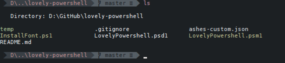

# lovely-powershell [via scoop-powershell-bucket](https://github.com/krokofant/scoop-powershell-bucket)

Makes PowerShell a bit prettier. Using my default config with oh-my-posh.



## Install

```powershell
# Install scoop if you haven't
set-executionpolicy remotesigned -s currentuser
iex (new-object net.webclient).downloadstring('https://get.scoop.sh')

# Install this module
scoop bucket add powershell-tools git@github.com:krokofant/scoop-powershell-bucket.git
scoop install lovelypowershell
```

And then add the import to your powershell profile

```powershell
Import-Module LovelyPowershell
```

## Uninstall

Might not remove all graphical changes like terminal colors.

```powershell
scoop uninstall lovelypowershell
```
