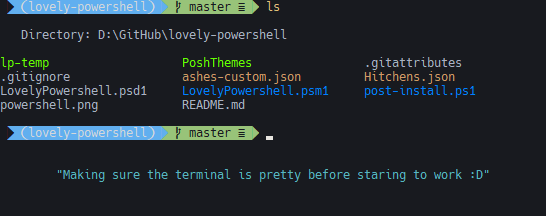

# ✨ Lovely Powershell

_✨ Lovely Powershell_ is here to make it easy to have a pretty PowerShell. Utilizing [oh-my-posh](https://github.com/JanDeDobbeleer/oh-my-posh) and custom console settings via [concfg](https://github.com/lukesampson/concfg).



## Installation

### 1. Install scoop

```powershell
set-executionpolicy remotesigned -s currentuser
iex (new-object net.webclient).downloadstring('https://get.scoop.sh')
```

### 2. Install the [powershell bucket](https://github.com/krokofant/scoop-powershell-bucket)

```powershell
scoop bucket add powershell-tools https://github.com/krokofant/scoop-powershell-bucket.git
```

### 3. Install lovely-powershell ❤

```powershell
scoop install lovelypowershell
```

And then add the import to your powershell profile

```powershell
Import-Module LovelyPowershell
```

## Uninstall

Might not remove all graphical changes like terminal colors.

```powershell
scoop uninstall lovelypowershell
```

---
